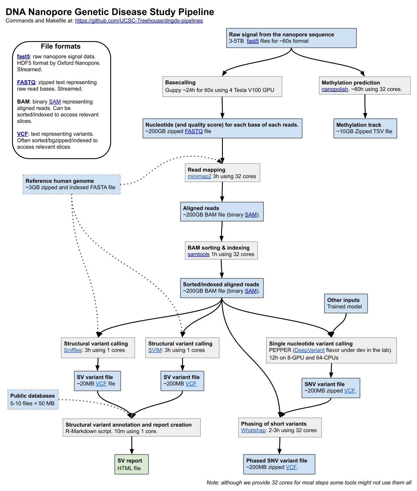

# UPD Pipelines
Tooling to run primary, secondary and tertiary pipelines for the UCSC Undiagnosed Pediatric Disease Center

We want the pipeline to cover:



## Requirements
* linux
* make
* docker
* 50G disk space for the chromosome 11 sample
* 256GB memory (?)
* 32+ cores (?)

## Quick Start

Clone this repo, create samples and references directories, download references, a chromosome 11 sample and run the sniffles variant caller with annotations:

```bash
git clone https://github.com/ucsc-upd/pipelines.git
cd pipelines
mkdir -p samples references
make samples/na12878-chr11/na12878-chr11.sniffles.ann.vcf
```

NOTE: The samples and references directories can be a symbolic links (i.e. to a scratch location or into a shared file system)

This will take approximately 30 minutes using 32 cores and generate the following output in samples/na12878-chr11:

```
1.3K Sep  8 11:00 minimap2.log
4.7G Sep  8 11:10 na12878-chr11.bam
3.6G Sep  8 10:25 na12878-chr11.fq.gz
  73 Sep  8 10:25 na12878-chr11.fq.gz.md5
5.8G Dec 21  2016 na12878-chr11.original.bam
 11G Sep  8 11:00 na12878-chr11.sam
3.1M Oct 22 12:51 na12878-chr11.sniffles.ann.vcf
835K Sep  8 11:29 na12878-chr11.sniffles.vcf
4.8G Sep  8 11:24 na12878-chr11.sorted.bam
```

## Structural variant report

```bash
make samples/na12878-chr11/na12878-chr11.sv-report.html
```

## Additional Samples

To process additional samples place their fastq in samples/<id>/<id>.fq.gz and call make for any specific target. For example:

```
make samples/<id>/<id>.sniffles.vcf
```

## Other Targets

We also use SVIM to call SVs from nanopore reads. 
The calls will be created to make the SV report but you can also create them with:

```
make samples/na12878-chr11/na12878-chr11.svim.vcf
```

### Whole-genome sequencing with short-reads

The following commands assume that the following two FASTQ files exist: `PATH/TO/FILE_R1.fq.gz` and `PATH/TO/FILE_R2.fq.gz`.
New files will be created in the same folder (`PATH/TO` in this example).

To just align the reads and run GATK post-alignment best practices:

```
make PATH/TO/FILE.sorted.RG.MD.BQSR.bam
```

To clean up (once the final BAM has been double-check), remove intermediate BAMs and files with:

```
make PATH/TO/FILE.sorted.RG.MD.BQSR.bam.clean_temp
```

To call structural variants with [smoove](https://github.com/brentp/smoove):

```
make PATH/TO/FILE.sorted.RG.MD.BQSR.smoove.vcf.gz
```

# Snakemake

I'm starting a Snakemake pipeline because it's much easier to write and automatically save useful information (e.g. compute resources)

Status of the Snakemake pipeline:
- [x] Mapping nanopore reads
- [x] SV calling using Sniffles and SVIM on the nanopore reads.
- [x] Quick coverage stats using indexcov for the nanopore reads.
- [ ] Mapping Illumina reads
- [x] CNV calling using Control-FREEC on Illumina reads
- [x] Making the SV report.
- [ ] Automated IGV/samplot images for selected regions.

```
snakemake --use-singularity --configfile sm_config.yml -p --cores 20 ill_cnvs

snakemake --use-singularity --configfile sm_config.yml -p PATH_TO_SAMPLE_ROOT/sv-report-SAMPLE_NAME.html
```

Note: add `-n` for a dry-run to see if everything is set-up (correct config file, necessary input files).

Note: I had some issues because I was running this from a folder with the content of this repo and I had sym-linked the folders with the references and sample data.
To be accessible to the container they needed to be explicitly mounted using like this:

```
SM_SING="-B `pwd`/samples:/private/groups/upd/samples -B `pwd`/references:/private/groups/upd/references"

snakemake --use-singularity --singularity-args "$SM_SING" --configfile sm_config.yml -p --cores 20 ill_cnvs -n
```
